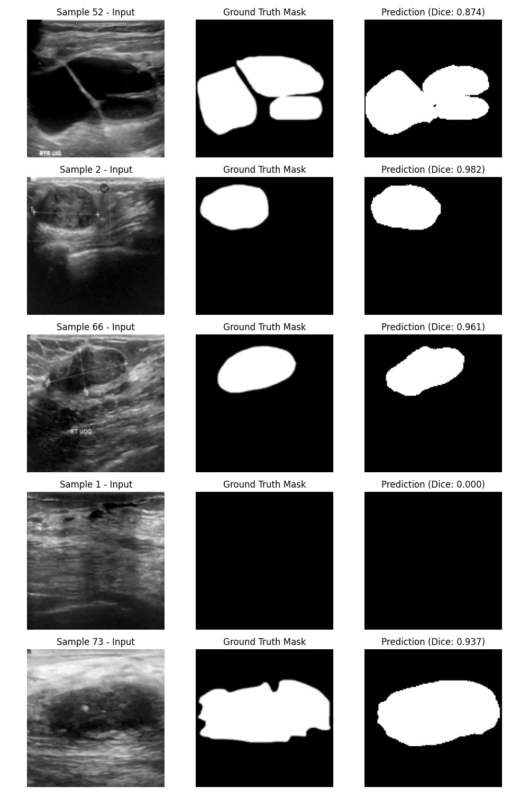
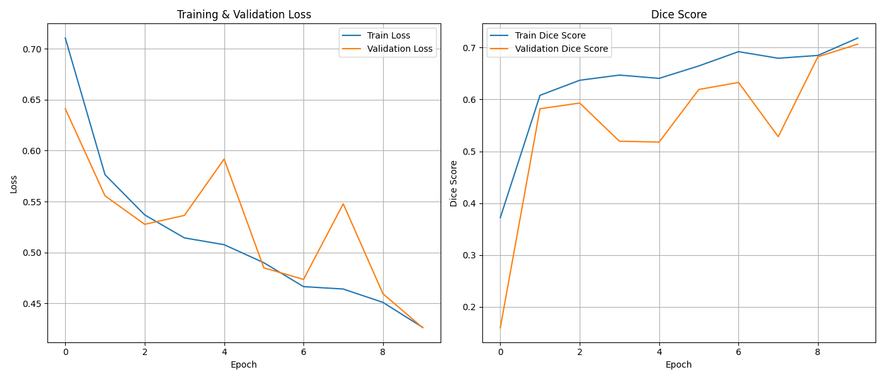
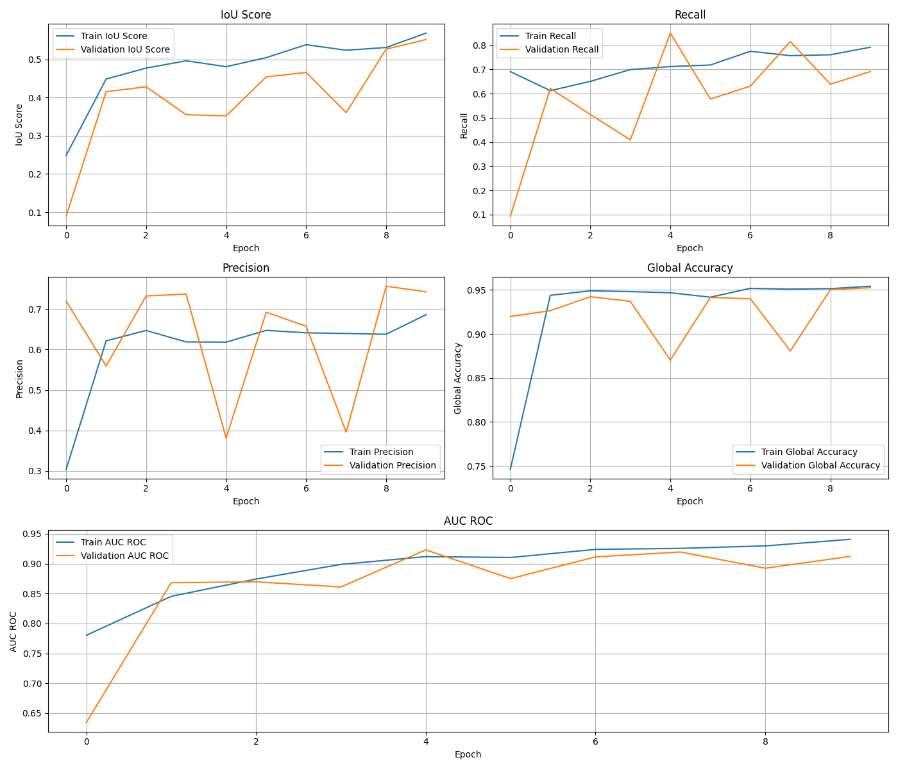

# 📌 Breast Cancer Segmentation

This project focuses on breast cancer segmentation in ultrasound images using a U-Net deep learning model. The model is trained to identify and segment regions of interest in breast ultrasound scans, generating segmentation masks that highlight possible abnormalities.

## 📝 Instructions for Training & Testing

### 🔹 1. Clone the Repository
First, clone the repository to your local machine:  
```bash
git clone https://github.com/filippawlicki/BreastCancerSegmentation.git
cd BreastCancerUltrasoundSegmentation
```

### 🔹 2. Install Dependencies  
Then, install the required dependencies:  
```bash
pip install -r requirements.txt
```

### 🔹 3. Train the Model  
Before training the model, you need to download the dataset. Instructions for downloading and preparing the dataset can be found in the [**Dataset**](#-dataset)
 section of the README.

To train the U-Net model on the dataset, run:  
```bash
python train.py
```
You can modify various training parameters inside `train.py`, such as:  
- **Batch size**
- **Weight decay**  
- **Learning rate**
- **Number of epochs**

The trained model will be saved in the `training_outputs/` directory.

### 🔹 4. Test the Model & Visualize Predictions  
After training, evaluate the model on unseen test data by running:  
```bash
python test.py
```
This script will:  
- Load the trained U-Net model  
- Generate segmentation predictions on the **test dataset**  
- Compute **Dice Score**  
- Save a visualization of sample predictions  

Sample results (original images, ground truth masks, and predicted masks) will be saved in the `predictions_output/` directory.
## 📂 Dataset


The data collected at baseline include breast ultrasound images among women between 25 and 75 years old. This data was organized in 2018. The number of patients is 600 females, patients. The dataset consists of 780 images with an average image size of 500*500 pixels. The images are in PNG format. The ground truth images are presented with original images. The images are categorized into three classes, which are standard, benign, and malignant.

The dataset can be downloaded from Kaggle:\
🔗 [Breast Ultrasound Segmentation Dataset](https://www.kaggle.com/datasets/sabahesaraki/breast-ultrasound-images-dataset/data)

After downloading the dataset, place it inside the project's root directory and name it as `dataset`.

## 📊 Results

### 🔹 Example Predictions  
Below are some example predictions made by the trained U-Net model. The images include the original ultrasound images, ground truth masks, and the predicted masks from the model.

  

### 🔹 Model Performance Metrics  
Here are the performance metrics that evaluate the model's segmentation capabilities, including **Dice Score**, **IoU**, **Accuracy**, **Precision**, **Recall** and **AUC ROC**.

  

  
## 🤝 Contributing

I welcome contributions to improve this project! If you'd like to contribute, please follow the steps below:

1. **Fork** the repository.
2. **Clone** your fork to your local machine.
3. **Create a new branch** for your feature or fix:
   ```bash
   git checkout -b feature-name
   ```
4. **Make your changes** and **commit** them:
   ```bash
   git commit -m 'Add new feature or fix'
   ```
5. **Push** your changes to your forked repository:
   ```bash
   git push origin feature-name
   ```
6. **Create a pull request** to the main repository.
## 📜 License

This project is licensed under the **MIT License** - see the [LICENSE](LICENSE) file for details.

